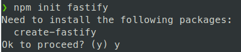
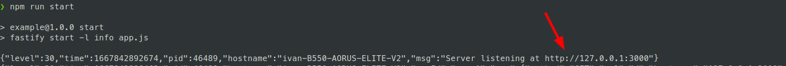
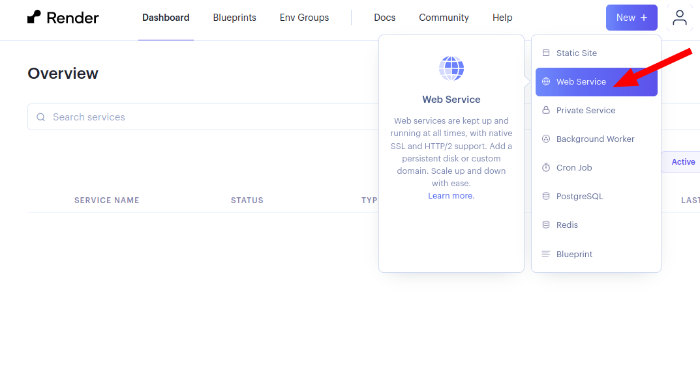
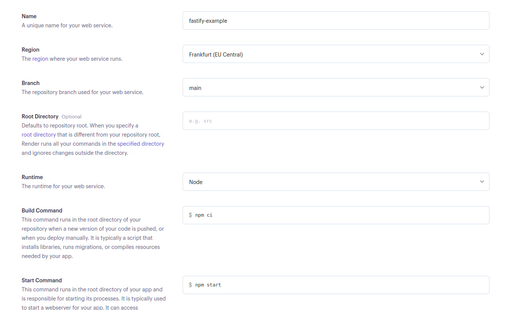
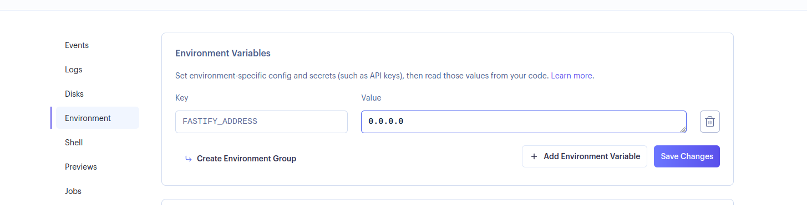
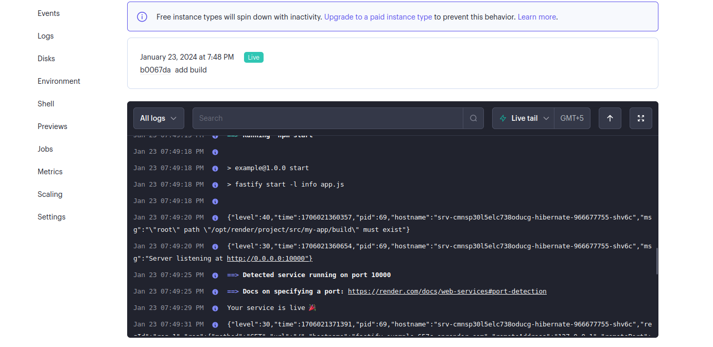
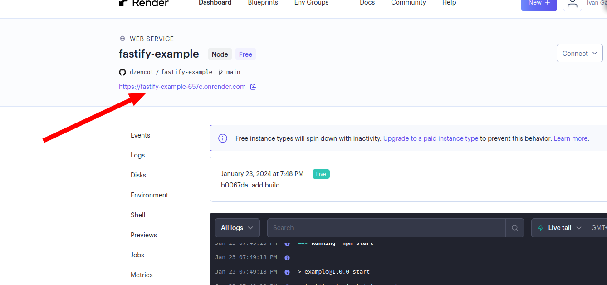
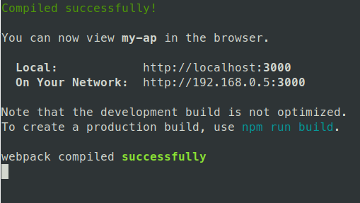
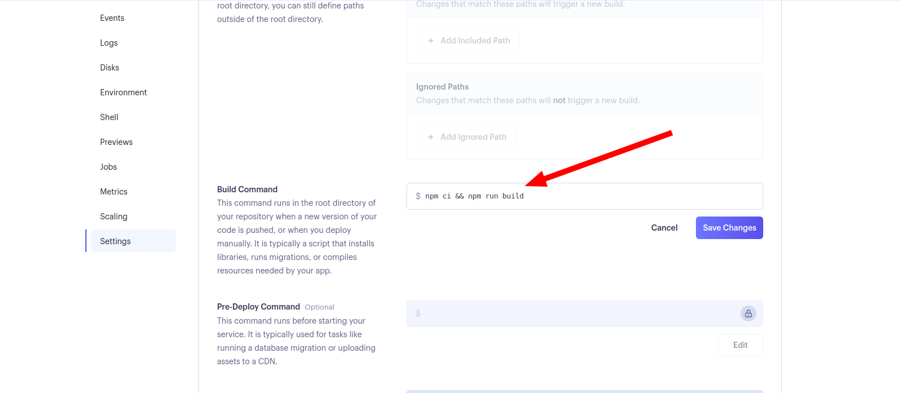

# Гайд по деплою приложения на render

В этом гайде вы научитесь деплоить приложение nodejs на https://render.com. У вас должен быть аккаунт на этом сервисе и на гитхабе. Гайд предполагает, что вы умеете работать с гитом и имеете представление работы на nodejs.

Гайд будет полезен бэкенд- и фронтенд-разработчикам

В процессе мы создадим небольшое hello-world приложение. Весь код [находится здесь](https://github.com/dzencot/fastify-example).

### Создание приложения

В качестве примера создадим приложение на фреймворке [fastify](https://www.fastify.io). Если вы фронтенд-разработчик и не собираетесь делать бэкенд-приложение, не расстраивайтесь. Я расскажу далее как подключить SPA-приложение на реакте и настроить деплой. Просто следуйте инструкциям.

Для создания приложения на `fastify` используйте команду:

```shell
npm init fastify
```

Если утилита запрашивает установку дополнительных пакетов, согласитесь (введите `y`)



Утилита сгенерирует файлы. После этого установите зависимости:

```shell
npm install
```

Проверьте что приложение работает. Для этого запустите его:

```shell
npm start
```

И перейдите по адресу сервера. Приложение подсказывает адрес:



Теперь все готово для деплоя на render.

### Первый деплой

Создайте репозиторий на гитхабе и запушьте приложение

Затем зайдите в свой аккаунт на [https://render.com](https://render.com) и нажмите "New +", далее выберите "Web Service"



Выберите пункт "Build and deploy from a Git repository"

Если ваш аккаунт на Github привязан, то вы сможете выбрать проект из списка репозиториев. Выберите нужный репозиторий с приложением. Либо введите адрес репозитория на Github в поле ниже

Заполните настройки приложения: придумайте любое имя, выберите регион, укажите команды установки и запуска, выберите тарифный план Free для бесплатного использования.



Для корректной работы приложения, добавьте переменную среды `PORT=0.0.0.0`. Либо вы можете это сделать позже, после создания сервиса.



Нажмите "Create Web Service". Через некоторое время приложение соберется и запустится.



Когда сервис запуститься, перейдите по ссылке задеплоенного приложения




Проверьте результат: `{"root":true}`.

Поздравляю, проект задеплоен и уже можно звать гостей!

### Деплой React-приложения

Теперь немного усложним проект, добавим в него SPA-приложение на реакте. Для этого в директории проекта выполните команду:

```shell
npx create-react-app my-app
```

Она создаст приложение на реакте в директории `my-app` в корне нашего проекта. Имя приложения `my-app` можете заменить на любое другое. 

Проверьте, что приложение работает. Для этого перейдите в директорию и запустите реакт-приложение:

```shell
npm start
```

После старта откроется страница в браузере с адресом приложения (по умолчанию [http://localhost:3000](http://localhost:3000)). Проверьте, что вы остановили fastify-проект, который мы создали ранее, чтобы он не занимал порт. Вы должны увидеть логотип реакта.

Приложение на реакте имеет особенность: его нужно собирать. Команда `npm start` запускает вебпак сервер, который предназначен для разработки, но не для полноценной работы. Об этом пишет само приложение после запуска:



Чтобы собрать приложение, выполните команду сборки в директории `my-app`:

```shell
npm run build
```

После этого появится директория **build** — это и есть наше собранное реакт-приложение, подготовленное для работы на проде.

Билд не включает в себя вебпак-сервер, поэтому нам нужен какой-то другой сервер, который будет предоставлять клиентам веб-приложение. Этим сервером будет наше приложение на `fastify`, которое мы до этого уже создали.

Нужно немного доработать наше fastify-приложение, чтобы оно умело раздавать фронт. Перейдите в корень проекта, все команды ниже будут выполняться в этой директории

Для работы со статикой (билдом реакт-приложения) установите библиотеку:

```shell
npm i @fastify/static
```

Отредактируйте файл *app.js*. В него нужно импортировать установленную библиотеку:

```javascript
const fastifyStatic = require('@fastify/static');
```

И добавьте внутри функции подключение нашего реакт приложения:

```javascript
fastify.register(fastifyStatic, {
  root: `${process.cwd()}/my-app/build`,
});
```

Добавьте обработчик по умолчанию, чтобы он возвращал страницу html: 

```javascript
fastify.setNotFoundHandler((req, res) => {
  res.sendFile('index.html');
});
```

Это даст возможность открывать реакт-приложение при любых несуществующих роутах. Полный код файла должен получиться таким:

```javascript
'use strict'

const path = require('path')
const AutoLoad = require('@fastify/autoload')
const fastifyStatic = require('@fastify/static');

module.exports = async function (fastify, opts) {
  // Place here your custom code!

  fastify.register(fastifyStatic, {
    root: `${process.cwd()}/my-app/build`,
  });

  fastify.setNotFoundHandler((req, res) => {
    res.sendFile('index.html');
  });

  // Do not touch the following lines

  // This loads all plugins defined in plugins
  // those should be support plugins that are reused
  // through your application
  fastify.register(AutoLoad, {
    dir: path.join(__dirname, 'plugins'),
    options: Object.assign({}, opts)
  });

  // This loads all plugins defined in routes
  // define your routes in one of these
  fastify.register(AutoLoad, {
    dir: path.join(__dirname, 'routes'),
    options: Object.assign({}, opts)
  });
}
```

Код написан с использованием commonJS-модулей. Можете переделать на ES-модули или оставить как есть. Не переживайте, если что-то в коде не понятно. Основная работа позади.

Проверьте, что приложение на реакте остановлено — оно может занимать порт. Запустите приложение fastify и откройте его в браузере, добавив к адресу любой путь, например [http://localhost:3000/somepath](http://localhost:3000/somepath). Если вы видите приложение на реакте, то все получилось.

Запушьте изменения в гитхаб. На render начнется автоматическая сборка приложения.

Перейдите в проект на render и проверьте работу. Приложение работает, но страница реакта недоступна. Так происходит, потому что директория **build** не попадает в репозиторий, а render на выполняет билд. В сервисе выполняются стандартные команды для запуска приложения.
Если мы склонируем проект в новую директорию и выполним `npm ci`, а затем `npm start`, то приложение на реакте так же не будет работать. Тоже самое делает и render. Перед запуском должно собираться реакт-приложение.

Для решения этой проблемы можно модифицировать *package.json*. Нужно добавить в него воркспейс с реакт-приложением, для этого добавьте "workspaces":

```
"workspaces": ["my-app"]
```

После добавления воркспейса выполните команду `npm install`, чтобы обновить `package-lock.json`.

Благодаря этому будут устанавливаться зависимости в директории **my-app** при каждой установке зависимостей в корневом проекте.

Для сборки фронтенд-приложения добавьте команду в секцию "scripts":

```
"build": "npm run build --prefix my-app"
```

Добавьте вызов команды сборки после установки зависимости, для этого вы можете модифицировать установку зависимостей, заменив ее на команду `npm ci && npm run build`:



Теперь render будет устанавливать зависимости в my-app и делать сборку перед запуском приложения.

Запушьте изменения, проверьте работу, проверьте страницу на реакте. Добавив к адресу путь `/somepath`.

Готовый проект для деплоя [находится здесь](https://github.com/dzencot/fastify-example)
